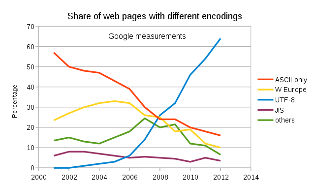

# 从零开始的 JSON 库教程（四）：Unicode

* Milo Yip
* 2016/10/2

本文是[《从零开始的 JSON 库教程》](https://zhuanlan.zhihu.com/json-tutorial)的第四个单元。代码位于 [json-tutorial/tutorial04](https://github.com/miloyip/json-tutorial/tree/master/tutorial04)。

本单元内容：

1. [Unicode](#1-unicode)
2. [需求](#2-需求)
3. [UTF-8 编码](#3-utf-8-编码)
4. [实现 `\uXXXX` 解析](#4-实现-uxxxx-解析)
5. [总结与练习](#5-总结与练习)

## 1. Unicode

在上一个单元，我们已经能解析「一般」的 JSON 字符串，仅仅没有处理 `\uXXXX` 这种转义序列。为了解析这种序列，我们必须了解有关 Unicode 的基本概念。

读者应该知道 ASCII，它是一种字符编码，把 128 个字符映射至整数 0 ~ 127。例如，`1` → 49，`A` → 65，`B` → 66 等等。这种 7-bit 字符编码系统非常简单，在计算机中以一个字节存储一个字符。然而，它仅适合美国英语，甚至一些英语中常用的标点符号、重音符号都不能表示，无法表示各国语言，特别是中日韩语等表意文字。

在 Unicode 出现之前，各地区制定了不同的编码系统，如中文主要用 GB 2312 和大五码、日文主要用 JIS 等。这样会造成很多不便，例如一个文本信息很难混合各种语言的文字。

因此，在上世纪80年代末，Xerox、Apple 等公司开始研究，是否能制定一套多语言的统一编码系统。后来，多个机构成立了 Unicode 联盟，在 1991 年释出 Unicode 1.0，收录了 24 种语言共 7161 个字符。在四分之一个世纪后的 2016年，Unicode 已释出 9.0 版本，收录 135 种语言共 128237 个字符。

这些字符被收录为统一字符集（Universal Coded Character Set, UCS），每个字符映射至一个整数码点（code point），码点的范围是 0 至 0x10FFFF，码点又通常记作 U+XXXX，当中 XXXX 为 16 进位数字。例如 `劲` → U+52B2、`峰` → U+5CF0。很明显，UCS 中的字符无法像 ASCII 般以一个字节存储。

因此，Unicode 还制定了各种储存码点的方式，这些方式称为  Unicode 转换格式（Uniform Transformation Format, UTF）。现时流行的 UTF 为 UTF-8、UTF-16 和 UTF-32。每种 UTF 会把一个码点储存为一至多个编码单元（code unit）。例如 UTF-8 的编码单元是 8 位的字节、UTF-16 为 16 位、UTF-32 为 32 位。除 UTF-32 外，UTF-8 和 UTF-16 都是可变长度编码。

UTF-8 成为现时互联网上最流行的格式，有几个原因：

1. 它采用字节为编码单元，不会有字节序（endianness）的问题。
2. 每个 ASCII 字符只需一个字节去储存。
3. 如果程序原来是以字节方式储存字符，理论上不需要特别改动就能处理 UTF-8 的数据。

## 2. 需求

由于 UTF-8 的普及性，大部分的 JSON 也通常会以 UTF-8 存储。我们的 JSON 库也会只支持 UTF-8。（RapidJSON 同时支持 UTF-8、UTF-16LE/BE、UTF-32LE/BE、ASCII。）

C 标准库没有关于 Unicode 的处理功能（C++11 有），我们会实现 JSON 库所需的字符编码处理功能。

对于非转义（unescaped）的字符，只要它们不少于 32（0 ~ 31 是不合法的编码单元），我们可以直接复制至结果，这一点我们稍后再说明。我们假设输入是以合法 UTF-8 编码。

而对于 JSON字符串中的 `\uXXXX` 是以 16 进制表示码点 U+0000 至 U+FFFF，我们需要：

1. 解析 4 位十六进制整数为码点；
2. 由于字符串是以 UTF-8 存储，我们要把这个码点编码成 UTF-8。

同学可能会发现，4 位的 16 进制数字只能表示 0 至 0xFFFF，但之前我们说 UCS 的码点是从 0 至 0x10FFFF，那怎么能表示多出来的码点？

其实，U+0000 至 U+FFFF 这组 Unicode 字符称为基本多文种平面（basic multilingual plane, BMP），还有另外 16 个平面。那么 BMP 以外的字符，JSON 会使用代理对（surrogate pair）表示 `\uXXXX\uYYYY`。在 BMP 中，保留了 2048 个代理码点。如果第一个码点是 U+D800 至 U+DBFF，我们便知道它的代码对的高代理项（high surrogate），之后应该伴随一个 U+DC00 至 U+DFFF 的低代理项（low surrogate）。然后，我们用下列公式把代理对 (H, L) 变换成真实的码点：

~~~
codepoint = 0x10000 + (H − 0xD800) × 0x400 + (L − 0xDC00)
~~~

举个例子，高音谱号字符 `𝄞` → U+1D11E 不是 BMP 之内的字符。在 JSON 中可写成转义序列 `\uD834\uDD1E`，我们解析第一个 `\uD834` 得到码点 U+D834，我们发现它是 U+D800 至 U+DBFF 内的码点，所以它是高代理项。然后我们解析下一个转义序列 `\uDD1E` 得到码点 U+DD1E，它在 U+DC00 至 U+DFFF 之内，是合法的低代理项。我们计算其码点：

~~~
H = 0xD834, L = 0xDD1E
codepoint = 0x10000 + (H − 0xD800) × 0x400 + (L − 0xDC00)
          = 0x10000 + (0xD834 - 0xD800) × 0x400 + (0xDD1E − 0xDC00)
          = 0x10000 + 0x34 × 0x400 + 0x11E
          = 0x10000 + 0xD000 + 0x11E
          = 0x1D11E
~~~

这样就得出这转义序列的码点，然后我们再把它编码成 UTF-8。如果只有高代理项而欠缺低代理项，或是低代理项不在合法码点范围，我们都返回 `LEPT_PARSE_INVALID_UNICODE_SURROGATE` 错误。如果 `\u` 后不是 4 位十六进位数字，则返回 `LEPT_PARSE_INVALID_UNICODE_HEX` 错误。

## 3. UTF-8 编码

UTF-8 在网页上的使用率势无可挡：

（图片来自 [Wikipedia Common](https://commons.wikimedia.org/wiki/File:Utf8webgrowth.svg)，数据来自 Google 对网页字符编码的统计。）

由于我们的 JSON 库也只支持 UTF-8，我们需要把码点编码成 UTF-8。这里简单介绍一下 UTF-8 的编码方式。

UTF-8 的编码单元是 8 位字节，每个码点编码成 1 至 4 个字节。它的编码方式很简单，按照码点的范围，把码点的二进位分拆成 1 至最多 4 个字节：

| 码点范围            | 码点位数  | 字节1     | 字节2    | 字节3    | 字节4     |
|:------------------:|:--------:|:--------:|:--------:|:--------:|:--------:|
| U+0000 ~ U+007F    | 7        | 0xxxxxxx |
| U+0080 ~ U+07FF    | 11       | 110xxxxx | 10xxxxxx |
| U+0800 ~ U+FFFF    | 16       | 1110xxxx | 10xxxxxx | 10xxxxxx |
| U+10000 ~ U+10FFFF | 21       | 11110xxx | 10xxxxxx | 10xxxxxx | 10xxxxxx |

这个编码方法的好处之一是，码点范围 U+0000 ~ U+007F 编码为一个字节，与 ASCII 编码兼容。这范围的 Unicode 码点也是和 ASCII 字符相同的。因此，一个 ASCII 文本也是一个 UTF-8 文本。

我们举一个例子解析多字节的情况，欧元符号 `€` → U+20AC：

1. U+20AC 在 U+0800 ~ U+FFFF 的范围内，应编码成 3 个字节。
2. U+20AC 的二进位为 10000010101100
3. 3 个字节的情况我们要 16 位的码点，所以在前面补两个 0，成为 0010000010101100
4. 按上表把二进位分成 3 组：0010, 000010, 101100
5. 加上每个字节的前缀：11100010, 10000010, 10101100
6. 用十六进位表示即：0xE2, 0x82, 0xAC

对于这例子的范围，对应的 C 代码是这样的：

~~~c
if (u >= 0x0800 && u <= 0xFFFF) {
    OutputByte(0xE0 | ((u >> 12) & 0xFF)); /* 0xE0 = 11000000 */
    OutputByte(0x80 | ((u >>  6) & 0x3F)); /* 0x80 = 10000000 */
    OutputByte(0x80 | ( u        & 0x3F)); /* 0x3F = 00111111 */
}
~~~

UTF-8 的解码稍复杂一点，但我们的 JSON 库不会校验 JSON 文本是否符合 UTF-8，所以这里也不展开了。

## 4. 实现 `\uXXXX` 解析

我们只需要在其它转义符的处理中加入对 `\uXXXX` 的处理：

~~~c
static int lept_parse_string(lept_context* c, lept_value* v) {
    unsigned u;
    /* ... */
    for (;;) {
        char ch = *p++;
        switch (ch) {
            /* ... */
            case '\\':
                switch (*p++) {
                    /* ... */
                    case 'u':
                        if (!(p = lept_parse_hex4(p, &u)))
                            STRING_ERROR(LEPT_PARSE_INVALID_UNICODE_HEX);
                        /* \TODO surrogate handling */
                        lept_encode_utf8(c, u);
                        break;
                    /* ... */
                }
            /* ... */
        }
    }
}
~~~

上面代码的过程很简单，遇到 `\u` 转义时，调用 `lept_parse_hex4()` 解析 4 位十六进数字，存储为码点 `u`。这个函数在成功时返回解析后的文本指针，失败返回 `NULL`。如果失败，就返回 `LEPT_PARSE_INVALID_UNICODE_HEX` 错误。最后，把码点编码成 UTF-8，写进缓冲区。这里没有处理代理对，留作练习。

顺带一提，我为 `lept_parse_string()` 做了个简单的重构，把返回错误码的处理抽取为宏：

~~~c
#define STRING_ERROR(ret) do { c->top = head; return ret; } while(0)
~~~

## 5. 总结与练习

本单元介绍了 Unicode 的基本知识，同学应该了解到一些常用的 Unicode 术语，如码点、编码单元、UTF-8、代理对等。这次的练习代码只有个空壳，要由同学填充。完成后应该能通过所有单元测试，届时我们的 JSON 字符串解析就完全符合标准了。

1. 实现 `lept_parse_hex4()`，不合法的十六进位数返回 `LEPT_PARSE_INVALID_UNICODE_HEX`。
2. 按第 3 节谈到的 UTF-8 编码原理，实现 `lept_encode_utf8()`。这函数假设码点在正确范围 U+0000 ~ U+10FFFF（用断言检测）。
3. 加入对代理对的处理，不正确的代理对范围要返回 `LEPT_PARSE_INVALID_UNICODE_SURROGATE` 错误。

如果你遇到问题，有不理解的地方，或是有建议，都欢迎在评论或 [issue](https://github.com/miloyip/json-tutorial/issues) 中提出，让所有人一起讨论。
